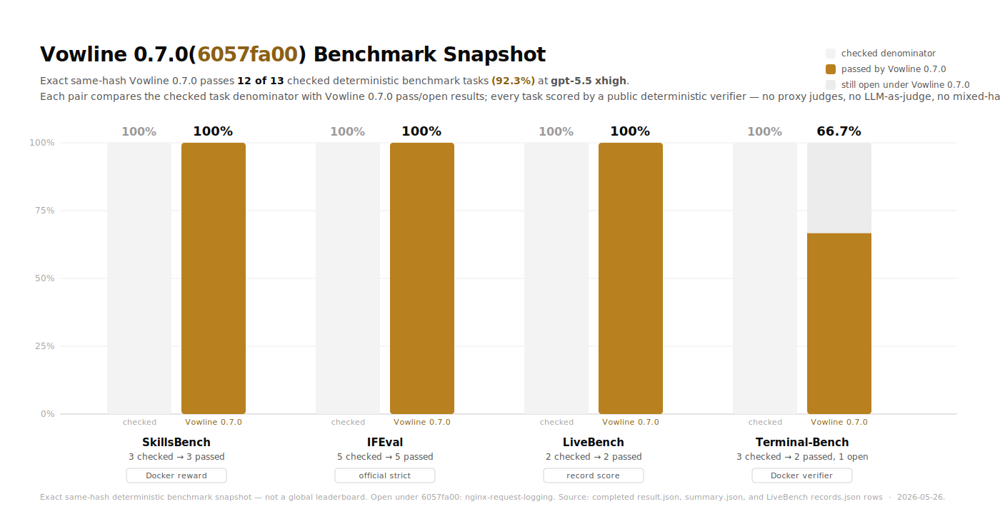

# Vowline

[](https://github.com/chojondocho/vowline/actions/workflows/check.yml)
[](https://github.com/chojondocho/vowline/releases)
[](LICENSE)

<p align="center">
  
</p>

**Universal operating skill: bind the public task, act from evidence, preserve boundaries, and verify the delivered result.**

Vowline is a portable `SKILL.md` package for Codex, Claude Code, Windsurf, Cursor, Gemini CLI, GitHub Copilot, and other skill-compatible agent harnesses. It gives agents the compact operating contract in `skills/vowline/SKILL.md`: bind the target and future client once, convert visible requirements into predicates over the final surface, preserve public labels and source-backed entity boundaries, prefer native structured tools, edit only the smallest live write set, and verify the delivered surface through the same interface a real user or official consumer will use.

Use it for substantive work with a real deliverable, constraints, evidence requirements, cleanup risk, data interpretation, artifact fidelity, repository scope, or completion criteria. Vowline never overrides higher-priority system, tool, safety, project, or explicit user instructions.

## Current benchmark snapshot

<p align="center">
  
</p>

A deterministic benchmark snapshot for the exact Vowline 0.7.0 skill body (`6057fa00a6c074fe2af5f28b0a11062e69e154acf6296d4c65eb8b63f1cd637c`) passes **12 / 13 checked tasks (92.3%)** at `gpt-5.5` with `xhigh` reasoning effort. The completed public/verifier-backed rows span SkillsBench, IFEval, LiveBench, and Terminal-Bench; `nginx-request-logging` is the only open task. This is mostly single-run deterministic verifier evidence, not a `pass@2` score or repeated-stability claim. No proxy judges, no LLM-as-judge, no mixed-hash rows, and no all-pass claim. See [`6057fa00_benchmark_snapshot.md`](docs/benchmarks/6057fa00_benchmark_snapshot.md) for the exact rows and result artifact paths. The earlier 0.6.0 failure-only comparison remains archived at [`8e427bb4_no_skill_comparison.md`](docs/benchmarks/8e427bb4_no_skill_comparison.md).

**This is not a benchmark-overfit skill.** The tested Vowline contract is a general operating discipline: target and future-client binding, final-surface predicates, public-label preservation, declared-source entity boundaries, scoped live writes, native structured tools, faithful consumer proof, and explicit reporting. It forbids encoding unavailable private facts, hidden tests, private fixtures, benchmark quirks, known answers, one-off paths, measurement tricks, hardcoded outputs, or verifier workarounds.

## Quick start

The easiest path is to ask the target agent to install Vowline for itself:

```text
Install Vowline for yourself by following https://github.com/chojondocho/vowline/blob/main/INSTALL.md. Verify installation.
```

For a project-local install, ask from inside the project:

```text
Install Vowline into this project by following https://github.com/chojondocho/vowline/blob/main/INSTALL.md. Use project-local paths. Verify installation.
```

To update an existing install after a Vowline release or contract change:

```text
Update Vowline for yourself by following https://github.com/chojondocho/vowline/blob/main/UPDATE.md. Verify the update.
```

You do not need to clone this repository if your agent can read GitHub and write the relevant local files. Vowline is designed to be installed by agents as well as by humans.

## What Vowline changes

Vowline does not add a rigid workflow. It changes the agent's default operating standard for work where incomplete evidence, unchecked artifacts, overbroad edits, hidden checker adaptation, malformed proof predicates, or vague completion claims would create failure.

| Area | 0.7.0 operating requirement |
| --- | --- |
| Public contract | Bind the target, future client, invocation surface, inputs, output surface, allowed writes, exclusions, success threshold, budget, and final-response shape once. |
| Working ledger | Track facts, sources, exceptions, references, unknowns, decisions, and proof predicates while separating declarations from references, examples from defaults, owner surfaces from fragments, and absence from zero. |
| Final-surface predicates | Convert requirements into checks over required and forbidden bytes, names, literals, case, wrappers, starts, endings, order, counts, domains, precision, persistence, and side effects. |
| Public labels | Preserve distinctive public modifiers and nouns when labels become internal or visible names; avoid generic carriers, synonyms, and private relabeling. |
| Source authority | Build entity rows, mappings, joins, aggregations, metrics, and native artifacts from declared sources and consumer-visible contracts instead of weak compatibility or sample-only support. |
| Tooling and proof | Prefer native structured tools and prove the final artifact or state through the same verifier, parser, renderer, workflow, service, or consumer that will use it. |
| Transferability | Optimize for general competence, not unavailable private facts, known answers, one-off paths, measurement tricks, or verifier workarounds. |

In practice, Vowline keeps agents focused on the same shape as the canonical `SKILL.md`:

```text
Respect higher-priority system, tool, safety, project, and explicit user instructions.
Bind the target, future client, invocation surface, and final surface once.
Inspect enough public structure to understand the task.
Create the first complete runnable artifact early.
Prefer native structured tools over ad hoc manipulation.
Convert requirements into final-surface predicates.
Edit the smallest live write set.
Preserve public labels, entity boundaries, missing values, and reference-only targets.
Verify the final artifact or runtime state through the real consumer.
Report the changed surface and current proof, separating blockers and non-proof.
```

## Why agents need it

Modern agents can already write, browse, edit, run tools, inspect files, call APIs, and produce artifacts. The recurring failure point is not only raw capability; it is loss of discipline at the boundary between task, evidence, edit scope, and proof.

Typical failures include treating partial artifacts as done, pre-seeding names or payloads a future client must create, expanding broad nouns into unrequested members, flattening missing data into zero, creating records from relation-only targets, accepting weak source matches, replacing a requested literal with a syntactic variant, proving an alternate artifact instead of the final surface, mutating history during cleanup, or reporting an old pass as current proof.

Vowline gives agents a portable default for those failure points. It makes the agent bind the target, future client, invocation surface, and final surface; keep facts, sources, exceptions, unknowns, decisions, and proof predicates separate; preserve public labels and declared entity boundaries; prefer native structured tools and real consumers; limit writes to the smallest live surface; and verify the delivered surface before declaring completion.

For the full details, see the canonical [`SKILL.md`](skills/vowline/SKILL.md).

## Supported agents

Vowline keeps the canonical behavior in `skills/vowline/SKILL.md` and installs host bridge files for tools that read rules, memories, or instruction files.

| Agent / harness | Project install writes |
| --- | --- |
| Codex / AGENTS-aware tools | `.agents/skills/vowline/SKILL.md`, `AGENTS.md` |
| Claude Code | `.claude/skills/vowline/SKILL.md`, `CLAUDE.md` |
| Windsurf | `.windsurf/skills/vowline/SKILL.md`, `.windsurf/rules/vowline.md` |
| Cursor | `.cursor/skills/vowline/SKILL.md`, `.cursor/rules/vowline.mdc` |
| Gemini CLI | `.gemini/skills/vowline/SKILL.md`, `GEMINI.md` |
| GitHub Copilot | `.github/skills/vowline/SKILL.md`, `.github/copilot-instructions.md` |
| Community `SKILL.md` targets | OpenCode, Amp, Goose, Cline, Roo Code, Aider, OpenClaw, Trae skill folders |

Codex uses `~/.agents/skills/vowline/SKILL.md` as the documented user-level skill path. The installer also mirrors the skill into `${CODEX_HOME:-~/.codex}/skills/vowline/SKILL.md` for compatibility with Codex environments that use `CODEX_HOME/skills`. Treat that mirror as compatibility support, not as the primary Codex path.

See [INSTALL.md](INSTALL.md) and [docs/COMPATIBILITY.md](docs/COMPATIBILITY.md) for exact global and project paths. See [UPDATE.md](UPDATE.md) and [UNINSTALL.md](UNINSTALL.md) for update and removal flows.

## Scripted install and update

The scripts are optional. They use only the Python standard library and are safe to run repeatedly.

Clone the repository first:

```bash
git clone https://github.com/chojondocho/vowline.git
cd vowline
```

Install into the current user's agent locations:

```bash
python3 install.py global --harnesses core
python3 install.py verify-global --harnesses core
```

Update an existing install by pulling the latest repository and running the same install command again:

```bash
git pull
python3 install.py global --harnesses core
python3 install.py verify-global --harnesses core
```

Install into one project:

```bash
python3 install.py project /path/to/project --harnesses core
python3 install.py verify /path/to/project --harnesses core
```

Install only selected harnesses:

```bash
python3 install.py project /path/to/project --harnesses codex,claude,windsurf
python3 install.py global --harnesses codex
```

Harness groups:

| Group | Includes |
| --- | --- |
| `core` | Codex, Claude Code, Windsurf, Cursor, Gemini CLI, GitHub Copilot |
| `community` | OpenCode, Amp, Goose, Cline, Roo Code, Aider, OpenClaw, Trae |
| `all` | `core` plus `community` |

The script default is `all`. Pass `--harnesses core` when you want only the mainstream host targets.

## How to use it

After installation, direct invocation is usually optional because host bridge files activate or route to Vowline where the host supports that pattern. Direct invocation is still useful when you want to force the skill for one request:

```text
$vowline repair this CLI and verify it through the public command surface
/vowline build this spreadsheet with real formulas and inspect the reopened workbook
@vowline audit this repository for active credential exposure only
$vowline produce this source-derived report without inventing unsupported rows
```

Codex commonly uses `$vowline`, Claude Code commonly uses `/vowline`, and Windsurf commonly uses `@vowline`. Other hosts may surface skills or rules differently.

## Repository layout

```text
skills/vowline/SKILL.md         Canonical Vowline contract
guidance/VOWLINE_ACTIVATION.md  Canonical activation bridge body
install.py                      Optional installer and verifier
uninstall.py                    Optional uninstaller and verifier
UPDATE.md                       Update guide for existing installs
docs/COMPATIBILITY.md           Supported paths and host notes
docs/benchmarks/                Benchmark summaries and charts
tests/                          Installer, verifier, and uninstall coverage
```

When Vowline edits an existing instruction file, it uses a marked block and preserves unrelated content. The activation body has one source of truth: [guidance/VOWLINE_ACTIVATION.md](guidance/VOWLINE_ACTIVATION.md).

```text
<!-- vowline:start -->
<contents of guidance/VOWLINE_ACTIVATION.md>
<!-- vowline:end -->
```

Repeated installs replace only that marked block. Generated rule files for Cursor and Windsurf use the same activation body with host-required front matter added by `install.py`. Manual installers can render the exact block or rule text with `python3 install.py render-guidance marked-block`, `python3 install.py render-guidance CURSOR.mdc`, or `python3 install.py render-guidance WINDSURF.md`.

Existing installs update by repeating the relevant install command from the latest repository. See [UPDATE.md](UPDATE.md).

## Development checks

Run the same basic checks used by the repository:

```bash
python3 -m py_compile install.py uninstall.py
python3 -m unittest discover -s tests
```

The tests cover project installs, global installs, harness selection, idempotent marked-block replacement, legacy cleanup, verification, and uninstall behavior.

## Uninstall

Ask the agent to remove Vowline:

```text
Uninstall Vowline from yourself by following https://github.com/chojondocho/vowline/blob/main/UNINSTALL.md. Verify removal.
```

Or use the optional script:

```bash
python3 uninstall.py global --harnesses core
python3 uninstall.py verify-global --harnesses core
```

For project-local removal:

```bash
python3 uninstall.py project /path/to/project --harnesses core
python3 uninstall.py verify /path/to/project --harnesses core
```

Uninstall removes Vowline-owned skill directories and Vowline marked blocks. It should not remove unrelated user or project instructions.

## Name

`Vowline` means a line of commitment: a small covenant tying the agent to the user's public outcome. It is not legal trademark clearance.

## License

MIT. See [LICENSE](LICENSE).
