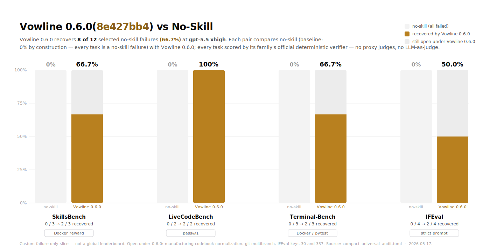

# Vowline 0.6.0(8e427bb4) vs No-Skill

The chart uses the current exact checked failure-only slice recorded in
`compact_universal_audit.toml`. It is not a global benchmark claim and it is
not an all-pass claim. It answers one narrow question: among tasks where
`no_skill` currently failed under deterministic public or official scoring,
how many did `final_vowline` recover with the same model setting
(`gpt-5.5`, reasoning effort `xhigh`)?

## Headline

| Condition | Task passes | Pass rate | Interpretation |
|---|---:|---:|---|
| `no_skill` | 0 / 12 | 0.0% | Zero by construction: this is a failure-only slice. |
| `final_vowline` at Vowline 0.6.0 (`8e427bb4`) | 8 / 12 | 66.7% | Eight valid no-skill failures recovered. |
| Absolute delta | +8 tasks | +66.7 pp | Same denominator, same model setting. |
| Still open | 4 / 12 | 33.3% | Not all-pass. |

## Family Breakdown

| Family | Recovered | Open | Recovery rate |
|---|---:|---:|---:|
| SkillsBench | 2 / 3 | 1 | 66.7% |
| LiveCodeBench | 2 / 2 | 0 | 100.0% |
| Terminal-Bench | 2 / 3 | 1 | 66.7% |
| IFEval | 2 / 4 | 2 | 50.0% |
| **Total** | **8 / 12** | **4** | **66.7%** |

## Exact Tasks

| Family | Task / key | What the task is | `no_skill` evidence | Vowline 0.6.0 (`8e427bb4`) `final_vowline` evidence | Result |
|---|---|---|---|---|---|
| SkillsBench | `dialogue-parser` | Convert `/app/script.txt` into validated `/app/dialogue.json` and `/app/dialogue.dot`, with a `parse_script(text)` implementation and graph reachability/edge constraints. | [r1 fail, reward 0.833](../../results/skillsbench-probe/dialogue-parser-no_skill-a521-current-noskill-r1b/result.json), [r2 fail, reward 0.833](../../results/skillsbench-probe/dialogue-parser-no_skill-a521-current-noskill-r2/result.json) | [pass, reward 1.0](../../results/skillsbench-probe/dialogue-parser-final_vowline-8e427bb4-dialogue-terminal-ref-r1/result.json) | PASS |
| SkillsBench | `sales-pivot-analysis` | Build `/root/demographic_analysis.xlsx` from `population.pdf` and `income.xlsx`, with four native Excel pivot tables and a joined `SourceData` table. | [r1 fail, reward 0.0](../../results/skillsbench-probe/sales-pivot-analysis-no_skill-a521-current-noskill-r1/result.json), [r2 fail, reward 0.0](../../results/skillsbench-probe/sales-pivot-analysis-no_skill-a521-current-noskill-r2/result.json) | [pass, reward 1.0](../../results/skillsbench-probe/sales-pivot-analysis-final_vowline-8e427bb4-sales-native-inner-r1/result.json) | PASS |
| SkillsBench | `manufacturing-codebook-normalization` | Normalize noisy manufacturing defect reasons from `test_center_logs.csv` into `/app/output/solution.json`, using product-specific codebooks, spans, codes, labels, confidence, and rationales. | [clean fail, reward 0.0](../../results/skillsbench-probe/manufacturing-codebook-normalization-no_skill-a521-current-noskill-r1/result.json) | [fail, reward 0.0](../../results/skillsbench-probe/manufacturing-codebook-normalization-final_vowline-8e427bb4-current-r1/result.json) | OPEN |
| LiveCodeBench | `abc399_e` / `Replace` | AtCoder ABC399 E: minimum operations to transform string `S` to `T` by replacing every occurrence of one lowercase letter with another. | [fail, pass@1 0.0](../../results/livecodebench-probe/no_skill-current-8d9b6d07-noskill-r1-abc399_e/result.json) | [pass, pass@1 1.0](../../results/livecodebench-probe/final_vowline-8e427bb4-abc399-r1-abc399_e/result.json) | PASS |
| LiveCodeBench | `arc196_d` / `Roadway` | AtCoder ARC196 D: answer interval queries about whether road-strength assignments can satisfy stamina constraints for selected travelers. | [fail, pass@1 0.0](../../results/livecodebench-probe/no_skill-8e427bb4-noskill-clean-r1-arc196_d/result.json) | [pass, pass@1 1.0](../../results/livecodebench-probe/final_vowline-8e427bb4-current-r1-arc196_d/result.json) | PASS |
| Terminal-Bench | `fix-git` | Find lost personal-site changes after checking out `master` and merge them back into `master`. | [r1 fail](../../results/terminal-bench-probe/fix-git-no_skill-a521-replacement-noskill-r1/result.json), [r2 fail](../../results/terminal-bench-probe/fix-git-no_skill-a521-replacement-noskill-r2/result.json) | [pass](../../results/terminal-bench-probe/fix-git-final_vowline-8e427bb4-current-r1/result.json) | PASS |
| Terminal-Bench | `swe-bench-astropy-2` | Fix Astropy `ascii.qdp` parsing so QDP commands are case-insensitive, including lowercase `read serr 1 2`. | [r1 fail](../../results/terminal-bench-probe/swe-bench-astropy-2-no_skill-current73-noskill-r1/result.json), [r2 fail](../../results/terminal-bench-probe/swe-bench-astropy-2-no_skill-current73-noskill-r2/result.json) | [pass](../../results/terminal-bench-probe/swe-bench-astropy-2-final_vowline-8e427bb4-current-r1/result.json) | PASS |
| Terminal-Bench | `git-multibranch` | Set up an SSH Git server at `git@localhost:/git/project`, accept password auth, deploy `main` and `dev` branches to separate HTTPS Nginx endpoints via `post-receive`. | [fail](../../results/terminal-bench-probe/git-multibranch-no_skill-8e427bb4-noskill-r1/result.json) | [fail](../../results/terminal-bench-probe/git-multibranch-final_vowline-8e427bb4-current-r1/result.json) | OPEN |
| IFEval | key `3114` | Follow all instructions: `length_constraints:number_words`, `keywords:forbidden_words`, `startend:end_checker`. | [summary: strict prompt fail, 2/3 instructions](../../results/ifeval-failure-bench/20260516T071022Z/summary.json) | [summary: strict and loose prompt pass, 3/3 instructions](../../results/ifeval-failure-bench/20260516T071022Z/summary.json) | PASS |
| IFEval | key `1000` | Follow all instructions: `punctuation:no_comma`, `detectable_format:number_highlighted_sections`, `length_constraints:number_words`. | [summary: strict prompt fail, 2/3 instructions](../../results/ifeval-failure-bench/20260516T092036Z/summary.json) | [summary: strict and loose prompt pass, 3/3 instructions](../../results/ifeval-failure-bench/20260516T092036Z/summary.json) | PASS |
| IFEval | key `30` | Follow all instructions: `startend:quotation`, `length_constraints:number_words`, `startend:quotation`. | [summary: strict prompt fail, 2/3 instructions](../../results/ifeval-failure-bench/20260516T092036Z/summary.json) | [summary: strict prompt fail, 2/3 instructions](../../results/ifeval-failure-bench/20260516T092036Z/summary.json) | OPEN |
| IFEval | key `337` | Follow all instructions: `length_constraints:number_words`, `detectable_format:title`. | [summary: strict prompt fail, 1/2 instructions](../../results/ifeval-failure-bench/20260516T092036Z/summary.json) | [summary: strict prompt fail, 1/2 instructions](../../results/ifeval-failure-bench/20260516T092036Z/summary.json) | OPEN |

## Scope Notes

- This is a custom failure-only subset, not a general leaderboard.
- `no_skill` has 0 task passes by construction because every denominator row was selected from current no-skill failures.
- Scoring is official or public deterministic: IFEval official evaluator, LiveCodeBench official pass@1 probe, Terminal-Bench Docker/pytest verifier, and SkillsBench Docker verifier/reward.
- Proxy-judge rows and blocked infrastructure rows are excluded from this chart.
- The Vowline 0.6.0 (`8e427bb4`) result is the best-so-far full-evidence baseline, not a solved final state. The currently open rows are `manufacturing-codebook-normalization`, `git-multibranch`, IFEval key `30`, and IFEval key `337`.
